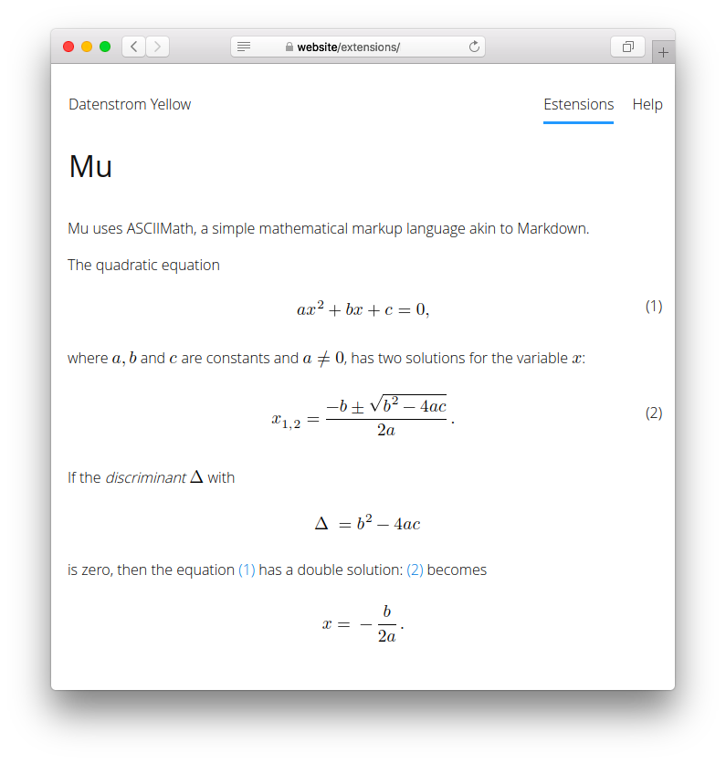

# Mu 0.9.2

Mathematical expressions with AsciiMath.

<p align="center"></p>

## How to install an extension

[Download ZIP file](https://github.com/GiovanniSalmeri/yellow-mu/archive/refs/heads/main.zip) and copy it into your `system/extensions` folder. [Learn more about extensions](https://github.com/annaesvensson/yellow-update).

## How to show a mathematical expression

With this extension you can write mathematical expressions with AsciiMath. [AsciiMath](http://asciimath.org/) is a simple mathematical markup language, akin to Markdown.

The first option is to write a mathematical expression with a shortcut. Create a `[mu]` shortcut. Wrap the whole expression in quotes if there are spaces, quotes or brackets. Inside the expression use `""` instead of `"`.

The second option is to write a mathematical expression with a code block. Wrap the whole expression in `` ``` `` and add the identifier `mu`.

## How to cross-refer to a mathematical expression

If you use a shortcut, add a label prefixed by `#` as second argument. If you use a code block, add after the identifier a label prefixed by `#` and wrapped in braces `{}`. The mathematical expression will be automatically numbered.

To refer to an expression, use the label prefixed by `#` and wrapped in brackets `[]`.

## Examples

An expression using a shortcut:

    [mu pi=3.1415926]
    [mu x=(-b+-sqrt(b^2-4ac))/(2a)]
    [mu "sum_(i=1)^n i^3=((n(n+1))/2)^2"]

An expression using a code block:

    ``` mu
    sum_(k=1)^n k = 1+2+ cdots +n=(n(n+1))/2
    ```

    ``` mu
    {(2x,+,17y,=,23),(x,-,y,=,5):}
    ```

An expression using a shortcut, numbered:

    [mu x=(-b+-sqrt(b^2-4ac))/(2a) #solutions]
    [mu "sum_(i=1)^n i^3=((n(n+1))/2)^2" #cubes]

An expression using a code block, numbered:

    ``` mu {#progression}
    sum_(k=1)^n k = 1+2+ cdots +n=(n(n+1))/2
    ```

A reference to an expression:

    The solutions of a quadratic equation are given by [#solutions].

## Settings

The following setting can be configured in file `system/extensions/yellow-system.ini`:

`MuPreferKatex` = use KaTeX for rendering AsciiMath expressions, 0 or 1; this setting only takes effect if the extension [Math](https://github.com/GiovanniSalmeri/yellow-math) is installed as well.

## Acknowledgements

This extension is based on [asciimathml](https://github.com/asciimath/asciimathml) by Peter Jipsen and on [asciimath2tex](https://github.com/christianp/asciimath2tex) by Christian Lawson-Perfect. Thank you for the good work.

## Developer

Giovanni Salmeri. [Get help](https://datenstrom.se/yellow/help/).
